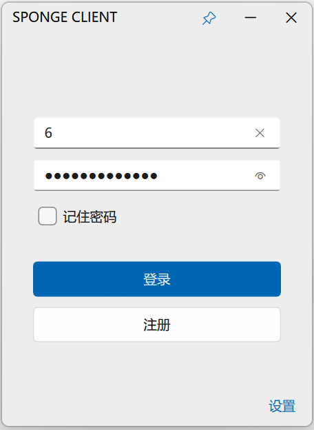
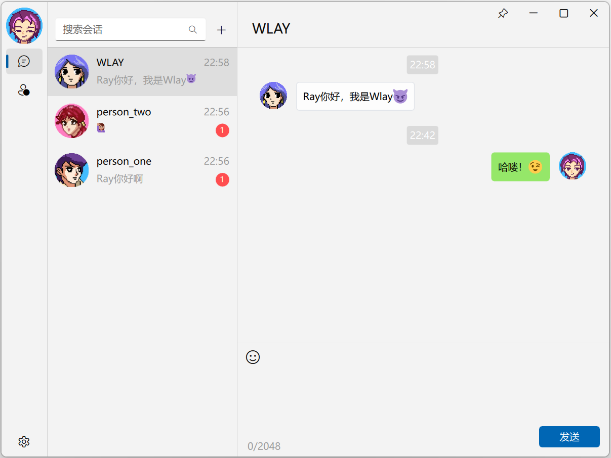
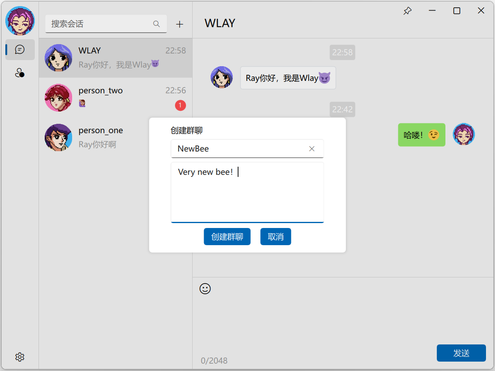
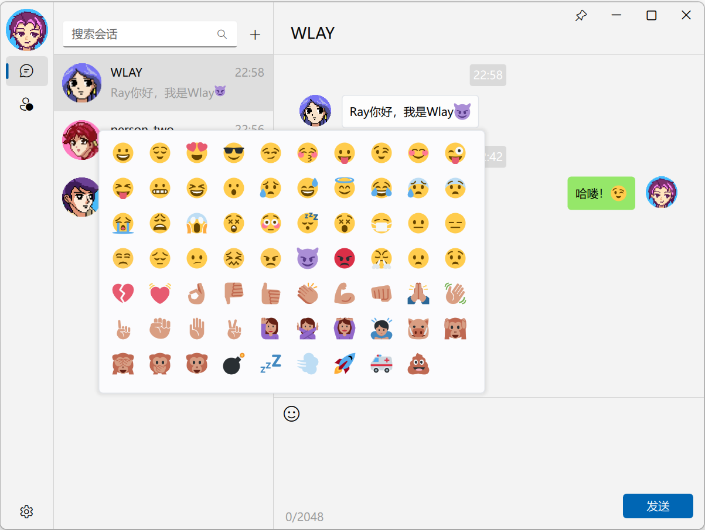
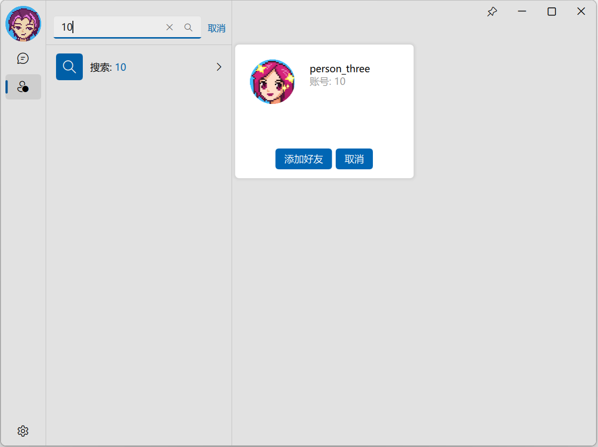

# 集群IM客户端，基于Qt6、QML和FluentUI开发

服务端的代码见 <https://github.com/WlayRay/RayBoxServer>

页面参考了 [https://github.com/zhuzichu520/kim-qt](https://github.com/zhuzichu520/kim-qt) 的代码，该项目是 FluentUI 的作者编写的，仅开源了客户端的代码，使用的是 websocket，服务端使用 netty 和 java 实现。

**注：** FluentUI 一直在更新，作者发布的最新版已经不适用与此项目，故项目文件包含用到的 FluentUI 版本。

## 部分页面展示

登录注册



主页面



创建群聊



发送表情包



添加好友



# 如何使用

首先需要启动服务端，见 <https://github.com/WlayRay/RayBoxServer>

客户端编译，测试过 QT6.2.4、6.6.2、5.15.2 这三个版本，其他 QT6 版本应该也可以

首先下载本仓库

```shell
git clone https://github.com/WlayRay/RayBoxClient.git
```

然后用 Qt creator 打开， 进行编译即可

在首次使用时，需要在设置中修改服务器的ip地址和端口号

当然也可以在[配置文件](src/res/server.ini)中修改

# 一些细节

服务器与客户端通信是直接使用的 TCP 长连接，服务端使用 muduo 网络库，客户端使用 QTcpSocket，网络断开之后会自动重连，通过 QTimer 定时发起连接，连接建立之后，自动重新登录。

发送的数据是用json格式进行包装，通过 <https://github.com/nlohmann/json> 库进行解析。

一些json数据格式样例如下：

```json
// 用户登录
{"msgType":1, "USERID":7, "password":"123456"}
// 注册用户
{"msgType":2, "name":"Eric Ling", "password":"whatever"}
// 退出登录
{"msgType":3, "USERID":7}
// 用户聊天
{"msgType":100,"FROMID":7,"TOID":9,"msg":"你好！","sendTime":1703078264002}
// 添加好友
{"msgType":6,"U1":1,"U2":2}
// 查找好友
{"msgType":8,"FROMID":6}
// 群聊消息
{"msgType":9,"FROMID":9,"GROUPID":10,"msg":"你们好！","sendTime":1703078264002}
// 加入群聊
{"msgType":10,"FROMID":6,"GROUPID":7}
// 创建群聊
{"msgType":12,"FROMID":6,"name":"cpp","description":"cpp group."}
// 查询离线消息
{"msgType":14,"FROMID":1}
// 查询账号
{"msgType":15,"keyword":"1"}
```

客户端离线消息的存储则是用 SQLite，使用 Qt 封装的 QSqlQuery 执行增删改查操作。

通过共享内存实现单例启动，具体代码见 [singleinstancechecker](src/singleinstancechecker.h)

一些配置则是用 QSettings 和 QVariant 存储到 ini 文件中。
